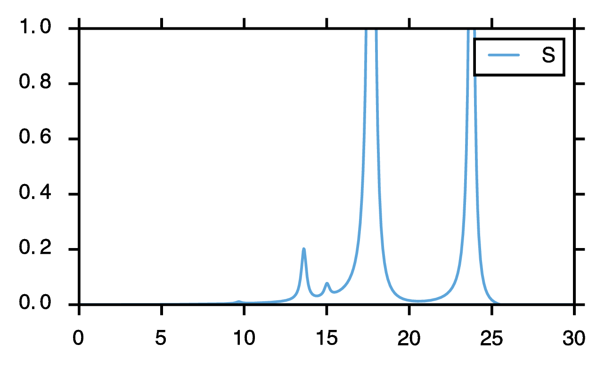
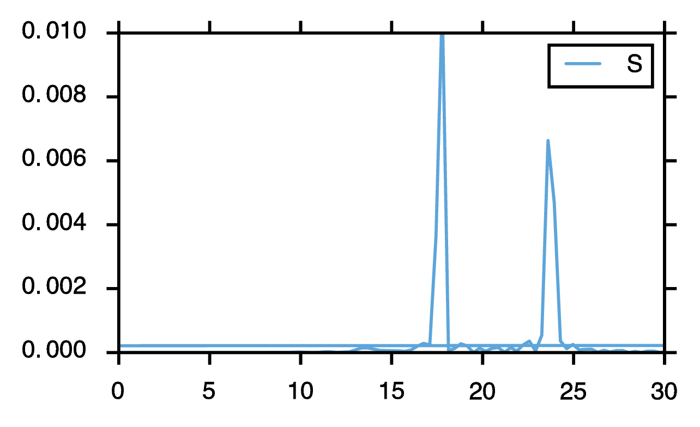

# cq_realtime 

This is a python script to generate the absorption spectrum from a real time time-dependent SCF calculation in the output of [Chronus Quantum](https://github.com/liresearchgroup/chronusq_public).

## Use

You can run the script as-is on the provided output (water/Restricted Hartree-Fock/STO-3G), just:

```bash
$ python cq_realtime.py
```

The files are hard-coded into the main part of the script. You can always import the function `cqRealTime` in your own python scripts like so:
```python
from cq_realtime import cqRealTime
``` 

### Arguments
```python
def cqRealTime(real_time_file,dipole_direction,kick_strength,damp_const):
    '''
        CQ_RealTime.py: a post-processing script for computing the absorption spectrum of
         Real Time Time Dependent SCF jobs in Chronus Quantum

        Computes the energy range, w (in eV) and dipole strength function S(w) for
         a given real time TD-SCF run.

        real_time_file   ... type:string ; the RealTime_Dipole.csv file from a ChronusQ run
        dipole_direction ... type:char   ; which dipole moment contribution is computed (e.g. 'x','y', or 'z')
        kick_strength    ... type:float  ; in a.u., what was the applied field strength (e.g. 0.0001 au)
        damp_const       ... type:float  ; in a.u. of time, gives FWHM of 2/damp_const
    '''
```

Returns `w`, and `S`, which are the frequencies and absorption cross sections.

## Theory(-ish)

Three input files are included for water in a STO-3G basis. If you have ChronusQ installed, you can run these files.

To get the absorption spectrum you need to give the system three independent "perturbations," so we give the system a delta-function electric field "kick" at the beginning (e.g. turn on the field for one time step) in three different directions (x,y,z).

Then we measure the time-evolving dipole moment of the system along the polarization of that field. A Fourier transform of this time evolution is proportional to the dipole strength function, and also related to the absorption cross section (which we measure in lab in a UV-Vis experiment).

The overall dipole strength function is determined by adding the "x dipole response to the x-delta kick" to the "y dipole response to the y-delta kick" to the "z dipole response to the z-delta kick".

## Requirements

This code is written in Python 2.7 and requires [numpy](http://www.numpy.org/), [matplotlib](http://matplotlib.org/), and [SciPy](http://www.scipy.org/). On Ubuntu you can just: 

```bash
$ sudo apt-get install python-numpy python-scipy python-matplotlib 
```

Or on Fedora:
```bash
$ sudo yum install numpy scipy python-matplotlib 
```

For Mac OS X, if you use [Macports](http://www.macports.org/):
```bash
$ sudo port install py27-numpy py27-scipy py27-matplotlib 
```

## Example: STO-3G water
For comparison, if you do the FFT analysis of the real-time data on the water example provided, your peaks and relative intensities should match the output below:

Remember, `f` is the dimensionless oscillator strength, and gives the magnitude of your peak at the given energy. So you should see a large peak at 17.7 eV, since it has the largest `f`, but no peak at 11.3 eV, because its `f` is zero.

``` 

 Excited State   1:      Singlet-B1     9.6540 eV   f=0.0021 

 Excited State   2:      Singlet-A2    11.3014 eV   f=0.0000 

 Excited State   3:      Singlet-A1    13.6088 eV   f=0.0548 

 Excited State   4:      Singlet-B2    15.0044 eV   f=0.0140 

 Excited State   5:      Singlet-B2    17.6951 eV   f=1.0986 

 Excited State   6:      Singlet-A1    23.7684 eV   f=0.6030 

 Excited State   7:      Singlet-A1    34.9187 eV   f=0.0219

 Excited State   8:      Singlet-B2    36.0245 eV   f=0.0022 

```



## Experimental: Compressed Sensing
If you want, you can try using compressed sensing techniques to replace the Fourier transform.

In principle, this is a technique to exploit the sparsity in the Fourier transform to beat the [Nyquist–Shannon sampling theorem](https://en.wikipedia.org/wiki/Nyquist%E2%80%93Shannon_sampling_theorem).

It is more expensive, so the default is to your time series to the first 1000 samples.

Details of the theory can be found at: 
Andrade, X., Sanders, J. N., & Aspuru-Guzik, A. (2012). Application of compressed sensing to the simulation of atomic systems. Proceedings of the National Academy of Sciences of the United States of America, 109(35), 13928–13933. http://doi.org/10.1073/pnas.1209890109

To use, you'll need to get the CVXPY package: http://www.cvxpy.org/

You can use `pip`:

```
  pip install cvxpy
```

To use, open the `cq_realtipme.py` file. Edit the option `doCS` at the bottom so that `doCS = True`. This will do the compressed sensing technique when you runt `cq_realtime`. Feel free to play around with the defaults. The CS function is found in `cs.py`. 

Here is what you get when you do the CS technique on the first 1000 samples of the `h2o_RealTime` datasets. On my machine it took around 30s to compute. On older machines this default setting may take upwards of a few minutes.




